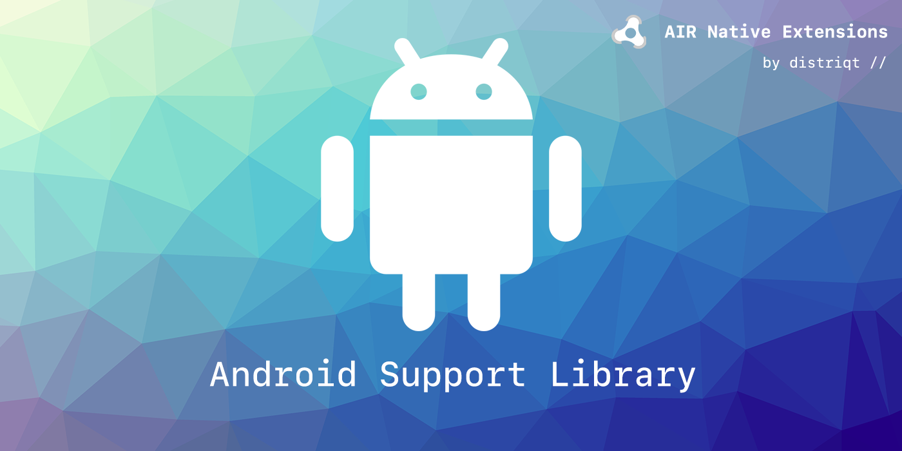

built by [distriqt //](https://airnativeextensions.com) 

# Google Play Developer Libraries

This repository contains a range of Google Play library extensions that are to be used as dependencies for distriqt extensions. However they can be used with any ANEs and are just packages containing the relevant libraries to avoid conflicts between extensions.

## Versions

The versions of the libraries is published in the [version documentation](https://github.com/airnativeextensions/ANE-GooglePlay/blob/master/lib/VERSION.md).

## Native Extensions

The highest quality and widest range of Native Extensions for Adobe AIR

With over 40 extensions available, we are the largest provider of native extensions for AIR developers. 
Our mobile solutions allow developers to fast-forward development and focus on building great games and apps.

https://airnativeextensions.com

